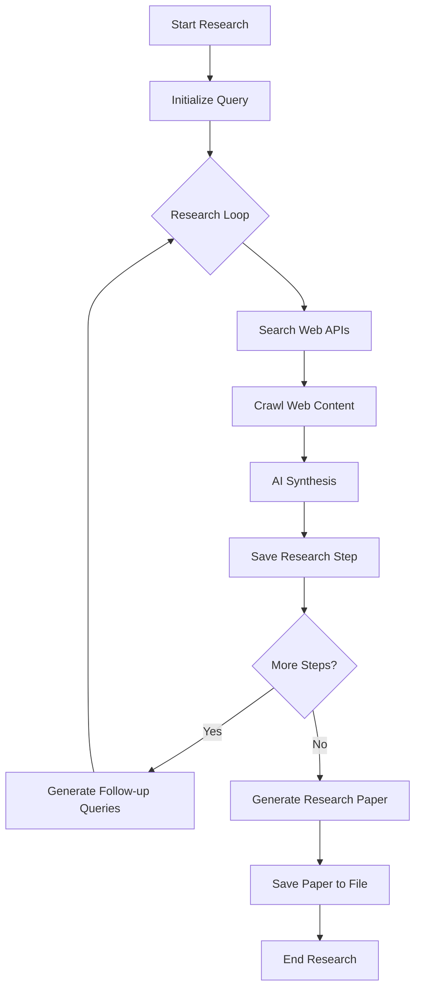

# Open Deep Search

An AI-powered web research tool that performs deep research on any topic by combining web searching, content crawling, and AI synthesis capabilities.

> **Note:** I'm using my own [affordable Google Search API](https://rapidapi.com/remote-skills-remote-skills-default/api/affordable-google-search-api) , which is currently hosted on RapidAPI.

## Features

- Automated multi-step research process
- Web content crawling and analysis
- AI-powered synthesis of findings
- Automatic follow-up query generation
- Research paper generation
- Detailed progress logging

## Requirements

- Node.js 16+
- OpenAI API key
- RapidAPI key (for Google Search API)
- Firecrawl API key

## Installation

1. Clone the repository
2. Install dependencies:
```bash
npm install
```
3. Create a `.env` file with your API keys:
```
OPENAI_API_KEY=your_openai_key
RAPIDAPI_KEY=your_rapidapi_key
FIRECRAWL_API_KEY=your_firecrawl_key
MAX_RESEARCH_STEPS=5
SEARCH_COUNTRY=us
SEARCH_LANG=en
SEARCH_DATE_RANGE=m
```

## Usage

Run the research agent with a topic:

```bash
npm start "Your research topic"
```

The research paper will be saved in the `research` folder.

## Research Process Flow



## Architecture

1. **Web Research Agent**
   - Manages the research process
   - Coordinates between different services
   - Handles error recovery and logging

2. **Services Used**
   - OpenAI API (GPT-4) for content analysis and synthesis
   - RapidAPI's Google Search API for web searches
   - Firecrawl for web content extraction

3. **Output**
   - Structured research paper in Markdown format
   - Detailed research steps and findings
   - Progress logs with emoji indicators

## Limitations

- Depends on third-party API availability
- Search results limited to recent content
- Web crawling may be blocked by some websites
- API costs may apply

## License

MIT
